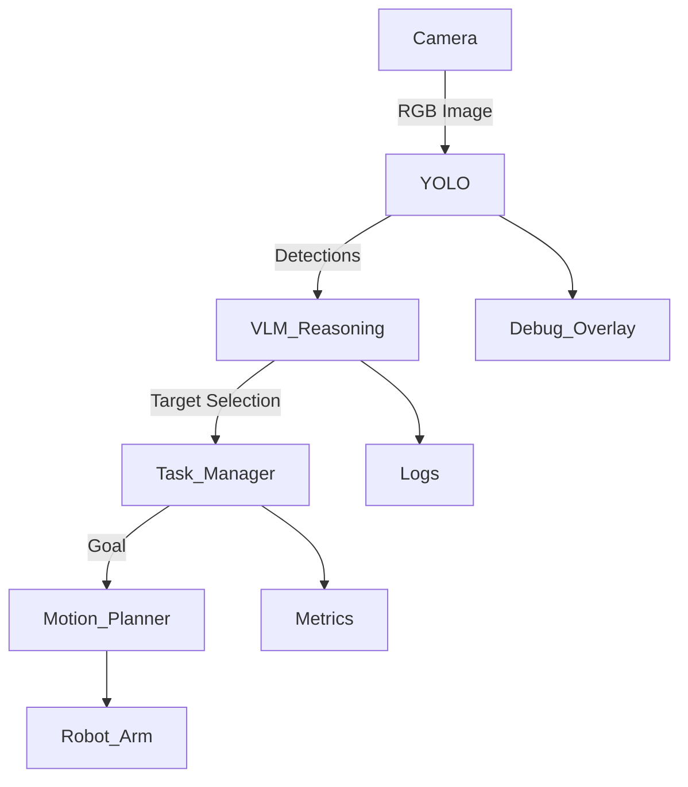

# Working Document — Task Aware Robotic Perception (Sim)

> Status: Draft
> Scope: v1 (Sim-only, perception-first)
> This document is a living working doc and will evolve with the project.

---

## 1. Project Motivation

Modern robotic systems struggle less with motion and more with **understanding what matters in a scene**.  
This project explores a perception-first robotics pipeline where vision and language guide task execution,
rather than hard-coded object lists.

The goal is not end-to-end learning, but a **modular, interpretable system** that reflects how
modern robotics teams build perception stacks in industry.

---

## 2. High-Level Goal

Build a **simulated robotic arm system** that:

- observes a scene through a fixed camera
- detects objects using a fast vision model (YOLO)
- reasons about task intent using a VLM-style abstraction
- performs a single, well-defined manipulation task
- exposes metrics, logs, and visual outputs for evaluation

This project is designed to be **extendable** (SAM, DINO, real hardware) but **intentionally scoped** for v1.

---

## 3. v1 Task Definition (Tentative)

**Single task (v1):**

> Detect a target object on a tabletop and perform a pick-and-place action.

### Constraints

- Fixed camera pose
- Fixed workspace
- Known object set
- Sim-only (ROS 2 + Gazebo)

These constraints are intentional and allow focus on perception quality, latency, and system design.

---

## 4. Non-Goals (v1)

The following are explicitly **out of scope** for the first version:

- Real robot hardware
- SAM / DINO / segmentation models
- End-to-end learning
- Multi-task planning
- Continuous language interaction

These may be added in later phases.

---

## 5. System Architecture (Conceptual)



---

## 6. Perception Pipeline (v1)

### Input

- RGB image from a fixed camera

### Perception Backend

- YOLO-based object detector
- Outputs:
  - Class labels
  - Bounding boxes
  - Confidence scores

### Reasoning Layer (VLM-style abstraction)

- Consumes object detections and task context
- Selects task-relevant object(s)
- Outputs structured decisions (not free-form language)

This layer may initially be rule-based and later replaced
or augmented with a true Vision-Language Model (VLM).

---

## 7. Robotics Stack

- **ROS 2:** Jazzy Jalisco
- **Simulation:** Gazebo Harmonic
- **Render Engine:** Ogre (explicitly forced)
- **Robot:** UR5e (planned)
- **Planning:** MoveIt 2 (Jazzy binaries)
- **Control:** Standard ROS controllers

The focus is on **system integration and perception-driven decision making**,
not low-level control tuning.

---

## 8. Launch & Runtime Configuration

### Launch Command

The full system is launched with:

```bash
ros2 launch task_aware_launch sim_camera.launch.py
```

This launch file performs the following:

1. Starts Gazebo Harmonic with:
   - `table_camera.sdf`
   - Physics enabled
   - Explicit render engine:
     ```
     --render-engine ogre
     ```

   Ogre is required to avoid known NVIDIA/EGL rendering issues on Ubuntu 24.04.

2. Starts `ros_gz_bridge` to bridge:

   - `/fixed_camera/rgb/image` → `/camera/color/image_raw`
   - `/fixed_camera/rgb/camera_info` → `/camera/camera_info`

3. Publishes static TF:

   ```
   world → fixed_camera/camera_link/rgb_camera
   ```

4. Launches RViz with a saved configuration:
   - Fixed Frame: `world`
   - Displays:
     - Image stream
     - TF tree

---

## 9. ROS Interface Contract (v1)

### Input Topics

- `/camera/color/image_raw` (sensor_msgs/Image)
- `/camera/camera_info` (sensor_msgs/CameraInfo)

### TF Frames

- `world`
- `fixed_camera/camera_link/rgb_camera`

### Observability

- `/task_aware/status` (dashboard summary output)

This contract is considered stable for v1.

---

## 10. Camera Configuration (v1)

- Resolution: 1280 × 720
- Update Rate: ~15 Hz
- Encoding: rgb8
- Frame ID: `fixed_camera/camera_link/rgb_camera`

These values were selected to balance:

- Simulation stability
- Real-time performance
- Clean demo output
- GPU utilization

Resolution may be reduced in later iterations if inference latency increases.

---

## 11. Observability & Dashboard

A lightweight runtime dashboard (`task_aware_dashboard`) provides
real-time system observability.

### Camera Health

- Topic name
- Measured FPS
- Frame staleness (ms)
- Resolution and encoding
- Frame ID

### Camera Intrinsics

- fx, fy, cx, cy
- Validity check

### TF Health

Verifies transform exists:

```
world → fixed_camera/camera_link/rgb_camera
```

### Bridge Health

Confirms:

- `ros_gz_bridge` node active

---

### Example Dashboard Output

Below is a representative example of the runtime dashboard during normal operation:


---

### Why Observability Matters

The dashboard ensures:

- The perception input is alive
- The simulation is not paused
- TF is valid
- Performance regressions are immediately visible

Observability is treated as a first-class requirement of the system.

---

## 12. Success Criteria (v1)

The project is considered successful when:

- The system runs end-to-end in simulation
- Object detection is stable and repeatable
- Target selection logic is explainable
- A clean demo video can be recorded
- The codebase is modular and extensible

---

## 13. Demo Plan

**Demo duration:** 30–60 seconds

### Demo flow:

1. Show initial simulation scene
2. Enable perception pipeline
3. Display detections and live metrics
4. Select target object
5. Execute task (e.g., pick-and-place)
6. Highlight successful completion

The demo should clearly communicate:

- What the system sees
- What it decides
- Why it decides it

---

## 14. Risks & Open Questions

- YOLO inference latency vs simulation FPS
- Camera placement tradeoffs
- Balance between VLM logic and rule-based task manager
- Best logging format (console vs structured JSON)

---

## 15. Future Extensions (Not Implemented)

- SAM for mask refinement
- GroundingDINO for open-vocabulary detection
- True VLM integration
- Scene memory
- Sim-to-real transfer

---

## 16. Personal Learning Goals

- Design stable ROS 2 interfaces
- Understand perception latency tradeoffs
- Build explainable robotics pipelines
- Practice industry-style system decomposition
- Maintain clean documentation alongside development

---

## Development Environment

- **OS:** Ubuntu 24.04.3
- **ROS 2:** Jazzy Jalisco (Debian packages)
- **Simulation:** Gazebo Harmonic
- **Render Engine:** Ogre
- **Planning:** MoveIt 2 (Jazzy)
- **Python:** `venv` for ML dependencies (YOLO stack)
- **GPU:** NVIDIA RTX 2070 SUPER
