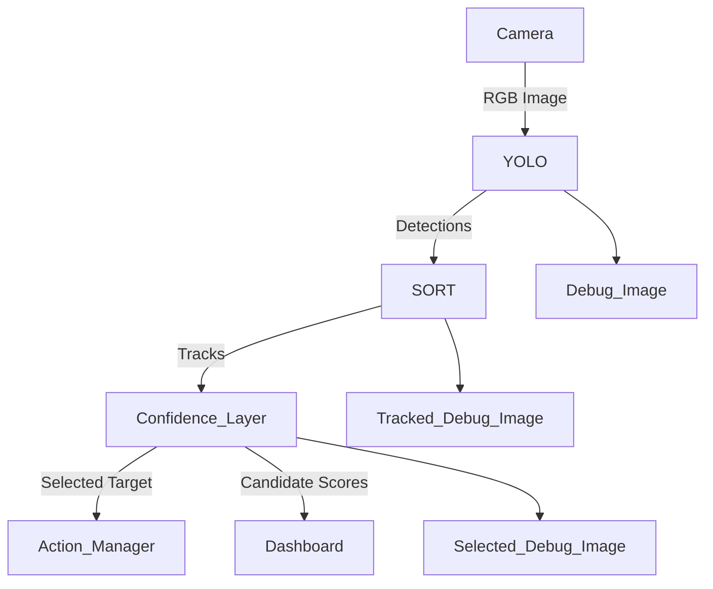
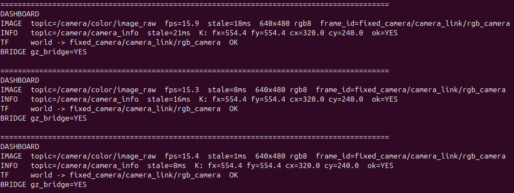

# Working Document — Task Aware Robotic Perception (Sim)

> Status: Active Development  
> Scope: v1 (Sim-only, perception-first, task-aware confidence layer)  
> This document is a living working doc and will evolve with the project.

---

## 1. Project Motivation

Modern robotic systems struggle less with motion and more with **understanding what matters in a scene**.

This project explores a perception-first robotics pipeline where:

- Vision detects the world  
- Tracking provides object continuity  
- A task-aware confidence layer interprets user intent  
- Decisions are structured, explainable, and observable  

The goal is not end-to-end learning, but a **modular, interpretable system**
that reflects how modern robotics teams design perception + reasoning stacks in industry.

---

## 2. High-Level Goal

Build a **task-aware simulated manipulation system** that:

- Observes a scene through a fixed RGB camera
- Detects objects using YOLO
- Tracks them persistently using SORT
- Allows natural language reference to objects
- Assigns custom names to objects
- Ranks candidates using a structured confidence model
- Simulates a “pick” action
- Exposes metrics, scoring logic, and reasoning output

The system is intentionally modular and extendable:
- ByteTrack upgrade
- SAM / segmentation
- VLM integration
- Real robotic arm integration

---

## 3. v1 Task Definition

> Detect objects on a tabletop, allow the user to reference them naturally, and simulate selecting and picking the intended object — even after scene movement.

### Capabilities in v1

- Persistent tracking via SORT
- Natural language commands:
  - `pick the red thing`
  - `pick red sphere`
  - `pick that again`
  - `pick the other one`
  - `call it red sphere`
- Custom user-defined object naming
- Scene shuffle event
- Re-identification after motion (tracking stability)
- Structured confidence-based target selection

---

## 4. Non-Goals (v1)

- Real robot hardware
- Grasp planning
- End-to-end reinforcement learning
- Continuous conversational dialogue
- Full Vision-Language Model integration

---

## 5. Updated System Architecture



---

## 6. Perception Stack

### 6.1 YOLO (Object Detection)

Publishes:

- Bounding boxes
- Class labels
- Confidence scores

Topic:
```
/perception/detections
```

YOLO runs on GPU (CUDA enabled via Python venv injection).

---

### 6.2 SORT (Tracking)

#### Why SORT (v1)

We selected SORT (Simple Online and Realtime Tracking) because:

- It provides persistent object IDs with minimal compute overhead.
- It is interpretable (Kalman filter + IoU matching).
- It runs in <1 ms per frame in our setup.
- It is stable under small object motion.
- It aligns with industry-standard tracking-by-detection pipelines.

Alternatives such as DeepSORT or ByteTrack were considered but deferred to future phases.

---

#### Algorithm Overview

SORT consists of:

1. **Kalman Filter Prediction**
   - Predicts next bounding box state for each track.

2. **IoU-based Matching**
   - Computes IoU between predicted boxes and current detections.

3. **Hungarian Assignment**
   - Optimally matches detections to tracks.

4. **Track Lifecycle Management**
   - `hits`: number of successful matches
   - `age`: frames since creation
   - `time_since_update`: frames since last matched
   - Tracks are deleted if `time_since_update > max_age`.

---

#### Current Parameters

- `iou_thresh`: 0.15–0.30
- `max_age`: 30 frames
- `min_hits`: 1

Lower IoU thresholds improve ID stability during minor motion.
Teleport-like movements may still cause ID changes.

---
Provides:

- Persistent `track_id`
- Smoothed confidence
- Track stability metrics (`hits`, `age`, `time_since_update`)

Topic:
```
/perception/detections
```

## 7. Task-Aware Confidence Layer

This is the core reasoning component of v1.

Instead of rule-based selection, the system computes:

\[
Score(track) = \sum w_i \cdot f_i(track)
\]

The highest-scoring candidate above threshold is selected.  
If no candidate exceeds threshold → system enters `CONFUSED`.

---

### 7.1 Semantic Memory (Per Track)

Each track maintains:

```json
{
  "user_name": "red sphere",
  "color": "red",
  "class_hist": {"kite": 80, "sports ball": 12},
  "conf_ema": 0.62,
  "last_seen": 1700.2,
  "last_access": 1705.1,
  "access_count": 3
}
```

### 7.2 Scoring Features

| Feature | Description |
|----------|-------------|
| Name Match | Exact or partial match with user-defined name |
| YOLO Class Match | Keyword match against stable class belief |
| Color Match | HSV-based color classification |
| Recency | Exponential decay of last reference |
| Usage | Access frequency bias |
| Stability | Based on track hits and staleness |

---

### 7.3 Example Weights (v1)

| Feature | Weight |
|----------|--------|
| Name match | 0.70 |
| YOLO class | 0.20 |
| Color | 0.15 |
| Recency | 0.10 |
| Usage | 0.05 |
| Stability | 0.10 |

Scores are normalized to `[0, 1]`.

Example threshold:
```
threshold = 0.55
```
If max score < threshold → `CONFUSED`.

---

### 7.4 Supported Commands (v1)

#### Selection

- `pick red sphere`
- `pick the red thing`
- `pick that`
- `pick that again`
- `pick the other one`

#### Naming

- `call it red sphere`
- `name it apple`

---

### 7.5 "Pick the Other One"

Algorithm:

1. Compute scores for all tracks
2. Exclude `last_selected_track_id`
3. Select highest-scoring remaining track
4. Require score ≥ threshold

Requires stored memory:
```
last_selected_track_id
```
---

## 8. Simulated Action Layer (v1)

In v1, "pick" is simulated.
It represents a state transition and selection event.
No physical motion planning is performed.

Selection triggers state transitions:

- `IDLE`
- `SELECTED`
- `PICKED`
- `CONFUSED`

Visual feedback:
- Highlighted bounding box
- Display name + score
- Dashboard state update

Future:
- Replace simulated pick with MoveIt2 motion planning.

---

## 9. Launch & Runtime

### Launch Command

```bash
ros2 launch task_aware_launch sim_camera.launch.py
```

Launch includes:

- Gazebo Harmonic
- `--render-engine ogre`
- ROS-Gazebo bridges
- Static TF
- RViz
- YOLO node
- SORT tracker
- Dashboard

---

## 10. ROS Interface Contract

### Inputs

- `/camera/color/image_raw`
- `/camera/camera_info`
- `/task_aware/task_text`

### Perception

- `/perception/detections`
- `/perception/tracks`

### Task Layer

- `/task_aware/candidates`
- `/task_aware/selected_target`
- `/task_aware/action_state`

### Debug

- `/perception/debug_image`
- `/perception/tracked_debug_image`
- `/task_aware/selected_debug_image`

---

# 11. Dashboard

The dashboard displays:

### Camera Health
- FPS
- Staleness
- Resolution

### Tracking Health
- Number of tracks
- Track IDs
- Tracker runtime

### YOLO Health
- Detection count
- Inference latency (ms)

### Task Layer
- Last selected track
- Selection score
- Action state
- Candidate count

Observability is treated as a first-class requirement.

A screenshot of the live dashboard ouput for visual reference. (As of 02/15/2026)


---

# 12. Scene Shuffle Demo

To demonstrate robustness:

1. Assign name:
   ```
   call it red sphere
   ```

2. Shuffle scene (small pose adjustments)

3. Execute:
   ```
   pick red sphere
   ```

System re-selects correct object using:

- Persistent tracking
- Semantic memory
- Confidence scoring

---

# 13. Success Criteria (v1)

- End-to-end pipeline runs
- Tracking IDs stable under minor motion
- Natural language selection works
- Confidence scoring explainable
- Scene shuffle does not break reference
- Clean demo video achievable

---

# 14. Upcoming Implementation Plan

## Phase 1 (Immediate)

- Implement confidence scoring engine
- Implement semantic memory store
- Publish candidate ranking topic
- Integrate threshold + confused state

## Phase 2

- Add recency decay
- Add usage bias
- Improve color classifier robustness

## Phase 3

- ByteTrack upgrade
- Name persistence layer
- Replace rule-based parsing with lightweight VLM

---

# 15. Future Extensions

- ByteTrack
- SAM mask refinement
- GroundingDINO
- Full VLM integration
- Real UR5e arm + MoveIt2
- Sim-to-real transfer

---

# 16. Development Environment

- **OS:** Ubuntu 24.04.3
- **ROS 2:** Jazzy Jalisco
- **Simulation:** Gazebo Harmonic
- **Render Engine:** Ogre
- **Tracking:** SORT (custom)
- **Detection:** YOLOv8
- **Python:** venv (isolated ML dependencies)
- **GPU:** NVIDIA RTX 2070 SUPER

---

# 17. Personal Learning Goals

- Design interpretable confidence systems
- Integrate perception + memory + reasoning
- Build explainable robotics architectures
- Practice modular ROS2 system design
- Maintain clean documentation alongside development