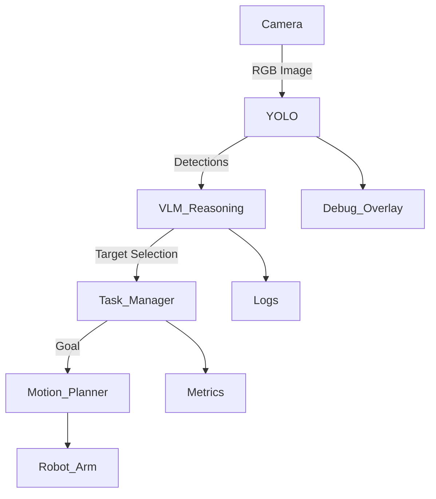

# Working Document — Task Aware Robotic Perception (Sim)

> Status: Draft
> Scope: v1 (Sim-only, perception-first)
> This document is a living working doc and will evolve with the project.

---

## 1. Project Motivation

Modern robotic systems struggle less wTith motion and more with **understanding what matters in a scene**.
This project explores a perception-first robotics pipeline where vision and language guide task execution,
rather than hard-coded object lists.

The goal is not end-to-end learning, but a **modular, interpretable system** that reflects how
modern robotics teams build perception stacks in industry.

---

## 2. High-Level Goal

Build a **simulated robotic arm system** that:

- observes a scene through a fixed camera
- detects objects using a fast vision model (YOLO)
- reasons about task intent using a VLM-style abstraction
- performs a single, well-defined manipulation task
- exposes metrics, logs, and visual outputs for evaluation

This project is designed to be **extendable** (SAM, DINO, real hardware) but **intentionally scoped** for v1.

---

## 3. v1 Task Definition (Tentative)

**Single task (v1):**

> Detect a target object on a tabletop and perform a pick-and-place action.

### Constraints

- Fixed camera pose
- Fixed workspace
- Known object set
- Sim-only (ROS 2 + Gazebo)

These constraints are intentional and allow focus on perception quality, latency, and system design.

---

## 4. Non-Goals (v1)

The following are explicitly **out of scope** for the first version:

- Real robot hardware
- SAM / DINO / segmentation models
- End-to-end learning
- Multi-task planning
- Continuous language interaction

These may be added in later phases.

---

## 5. System Architecture (Conceptual)

---

## 6. Perception Pipeline (v1)

### Input

- RGB image from a fixed camera

### Perception Backend

- YOLO-based object detector
- Outputs class labels, bounding boxes, and confidence scores

### Reasoning Layer (VLM-style)

- Consumes object detections and task context
- Selects task-relevant object(s)
- Outputs **structured decisions** (not free-form language)

This layer may be implemented as rule-based logic in v1 and later replaced
or augmented with a true Vision-Language Model (VLM).

---

## 7. Robotics Stack

- **Simulation:** Gazebo Harmonic
- **Robot:** UR5e (or equivalent articulated robotic arm)
- **Planning:** Classical motion planning (e.g., MoveIt2)
- **Control:** Standard ROS controllers

The focus is on **system integration and perception-driven decision making**,
not low-level control tuning.

---

## 8. Observability & Debugging

Visibility into system behavior is treated as a first-class requirement.

### Visual Outputs

- Object detection overlays (RViz)
- Selected target highlighting
- Robot execution visualization

### Metrics & Logs

- Inference latency (ms)
- Frames per second (FPS)
- Detection count per frame
- Target selection result
- Task success / failure state

Metrics will be exposed via:

- ROS topics
- Console output
- (Optional) CSV / JSON logs for offline analysis

A lightweight dashboard or RViz panel may be added if it proves useful.

---

## 9. Success Criteria (v1)

The project is considered successful when:

- The system runs end-to-end in simulation
- Object detection is stable and repeatable
- Target selection logic is explainable
- A clean demo video can be recorded
- The codebase is modular, readable, and extensible

---

## 10. Demo Plan

**Demo duration:** 30–60 seconds

**Demo flow:**

1. Show initial simulation scene
2. Enable perception pipeline
3. Display detections and live metrics
4. Select target object
5. Execute task (e.g., pick-and-place)
6. Highlight successful completion

The demo should clearly communicate **what the system is doing and why**.

---

## 11. Risks & Open Questions

- YOLO inference latency vs simulation FPS
- Camera placement tradeoffs
- How much reasoning should live in the VLM layer vs a task manager
- Best format for logging and metrics visualization

These questions will be revisited during implementation.

---

## 12. Future Extensions (Not Implemented)

- SAM for mask refinement and improved grasp accuracy
- GroundingDINO for open-vocabulary object detection
- True VLM integration for language-driven task specification
- Scene memory and object permanence
- Sim-to-real transfer

---

## 13. Personal Learning Goals

- Design clean and stable ROS2 interfaces
- Understand perception latency and performance tradeoffs
- Build explainable, task-aware robotics pipelines
- Practice industry-style system decomposition and documentation

---

> This document prioritizes clarity over completeness.
> Scope may evolve, but all major decisions should be recorded here.

---

## Development Environment

- **OS:** Ubuntu 24.04.3
- **ROS 2:** Jazzy Jalisco (Debian packages)
- **Simulation:** Gazebo Harmonic
- **Planning:** MoveIt 2 (Jazzy binaries)
- **Python:** `venv` for ML dependencies (YOLO stack)
